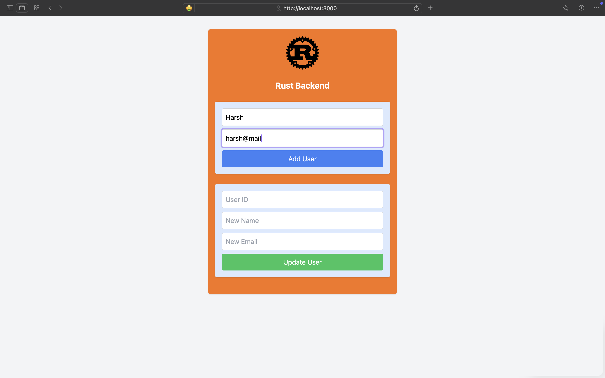
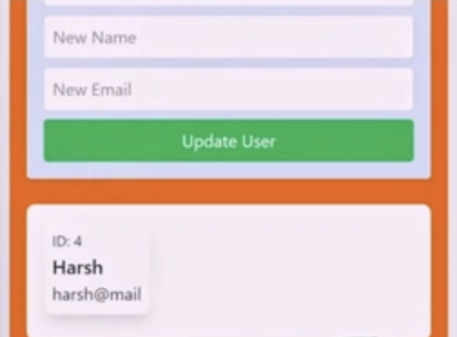

# LoggedIn

A simple login-logout CRUD application built using:

- **Frontend**: Next.js 14
- **Backend**: Rust (no framework, using Serde for serialization)
- **Database**: PostgreSQL
- **Containerization**: Docker & Docker Compose

## Architecture

The application consists of three Docker containers:
1. **Frontend** (Next.js 14)*
2. **Backend** (Rust API server)*
3. **Database** (PostgreSQL)

All containers are orchestrated using `Docker Compose`.

## Features

- User authentication (login/logout)
- Full CRUD operations
- PostgreSQL database storage

## Prerequisites

Make sure you have the following installed:

- [Docker](https://www.docker.com/)

_Optional (if you want to build manually):_
- [Node.js & npm](https://nodejs.org/)
- [Rust](https://www.rust-lang.org/)

## Setup & Run

1. Clone the repository:
   ```sh
   git clone https://github.com/vats004/LoggedIn.git
   cd login-logout-app
   ```
2. Start the application:
   ```sh
   docker-compose up
   ```
3. Open your browser and visit:
   ```
   http://localhost:3000
   ```

<p align="center">
  
  
</p>


You can also see the user entries by running

`docker exec -it db psql -U postgres`
```sh
$ docker exec -it db psql -U postgres
psql (13.13 (Debian 13.13-1.pgdg120+1))
Type "help" for help.

postgres=# select * from users;
 id |    name          |   email    
----+------------------+---------------
  3 | Vatsal           |  something@mail.com
  4 | Harsh            |  harsh@mail
  1 | Deep             |  toodeep@yahoo.com
(3 rows)
```
*Used FracesCoxx dockerhub repositories for rust and next
